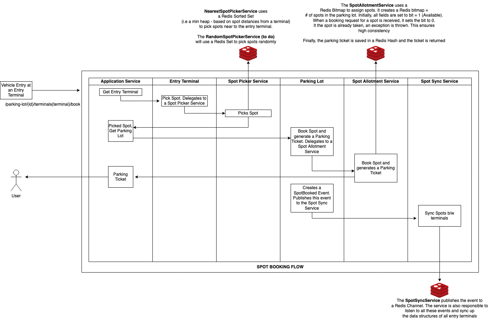
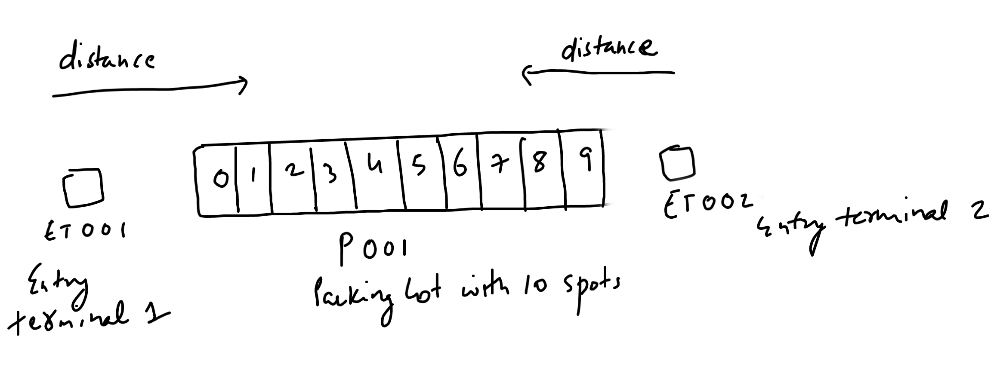

# Parking Lot

## Concepts

#### Entry Terminal and SpotPickerService

The Entry terminal 'Has A' *SpotPickerService*. When a vehicle arrives at an entry terminal, it delegates requests to pick a spot to this service. 
The idea is to support different spot picking strategies. The *NearestSpotPickerService* uses a Redis Sorted Set 
(i.e a min heap for each terminal - based on spot distances from a terminal) to pick spots near to the entry terminal.
The *RandomSpotPickerService* (to do) will use a Redis Set to pick spots randomly.

#### Parking Lot and SpotAllotmentService

The Parking lot 'Has A' *SpotAllotmentService*. It delegates requests to book a spot to this service.
The SpotAllotmentService uses a Redis Bitmap to allot spots. It creates a Redis bitmap = # of spots in the parking lot. 
Initially, all offsets are set to bit = 1 (Available). When a booking request for a spot is received, it sets the bit for that spot to 0.
It the spot is already taken, an exception is thrown. This ensures high consistency.

Finally, the parking ticket is saved in a Redis Hash and the ticket is returned. The Parking lot also creates a SpotBooked event and pushes 
that to a *SpotSyncService*.

#### SpotSyncService

The *SpotSyncService* is used to sync spot details across terminals, since each terminal has it's own data structure (or parking chart) that 
it uses to pick spots. When a spot is booked, a SpotBooked event is sent to a Redis Channel. The SpotSyncService listens to this channel and
delegates the spot updates to the SpotPickerService. The SpotPickerService can then remove this spot from it's parking chart.

## Spot Booking Flow

The application is initialised with a test parking lot that has 10 spots and 2 entry terminals.

A GET request to localhost:11101/v1/parking-lot/P001/chart gives the following output since the entire parking lot is empty:

`
    {
        "parkingId": "P001",
        "spots": [
            {
                "spotId": "0",
                "empty": true,        
            },
            {
                "spotId": "1",
                "empty": true,
            },
            {
                "spotId": "2",
                "empty": true,        
            },
            {
                "spotId": "3",
                "empty": true,
            },
            {
                "spotId": "4",
                "empty": true,
            },
            {
                "spotId": "5",
                "empty": true,
            },
            {
                "spotId": "6",
                "empty": true,
            },
            {
                "spotId": "7",
                "empty": true,
            },
            {
                "spotId": "8",
                "empty": true,
            },
            {
                "spotId": "9",
                "empty": true,
            }
        ]
    }
`

Let's now try to book a spot using entry terminal ET001 (POST llocalhost:11101/v1/parking-lot/P001/terminals/ET001/book)

Request:

`
    {
        "vehicleNo": "MH14 001",
        "vehicleType": "LMV"
    }
`

Response:

`
    {
        "ticketId": "2022-11-28:P001:ET001:f5fc7",
        "parkingLotId": "P001",
        "entryTerminalId": "ET001",
        "spotId": "0",
        "entryTime": "2022-11-28",
        "vehicleNo": "MH14 001",
        "vehicleType": "LMV"
    }    
`

The Entry terminal ET001 picked the spot 0 since it is the nearest non empty spot.
Let's try to book a spot using the entry terminal ET002

POST localhost:11101/v1/parking-lot/P001/terminals/ET002/book

Request: 

`
    {
        "vehicleNo": "MH14 002",
        "vehicleType": "LMV"
    }
`

Response:

`
    {
        "ticketId": "2022-11-28:P001:ET002:6bf0a",
        "parkingLotId": "P001",
        "entryTerminalId": "ET002",
        "spotId": "9",
        "entryTime": "2022-11-28",
        "vehicleNo": "MH14 002",
        "vehicleType": "LMV"
    }
`

The entry terminal ET002 picked the spot 9 since it is the nearst non empty spot.

Current Parking Chart (GET localhost:11101/v1/parking-lot/P001/chart):

`
    {
        "parkingId": "P001",
        "spots": [
            {
                "spotId": "0",
                "empty": false,
            },
            {
                "spotId": "1",
                "empty": true,
            },
            {
                "spotId": "2",
                "empty": true,
            },
            {
                "spotId": "3",
                "empty": true,
            },
            {
                "spotId": "4",
                "empty": true,
            },
            {
                "spotId": "5",
                "empty": true,
            },
            {
                "spotId": "6",
                "empty": true,
            },
            {
                "spotId": "7",
                "empty": true,
            },
            {
                "spotId": "8",
                "empty": true,
            },
            {
                "spotId": "9",
                "empty": false,
            }
        ]
    }
`